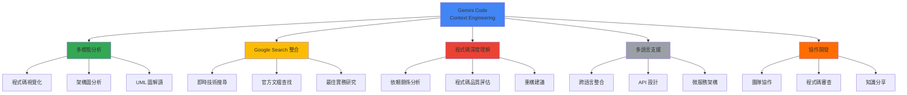
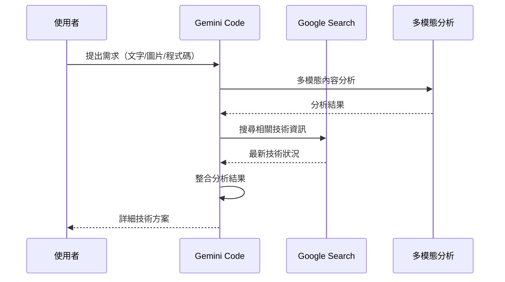
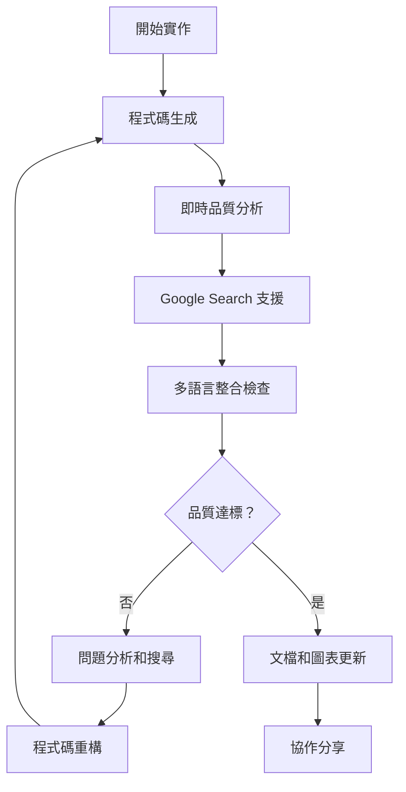
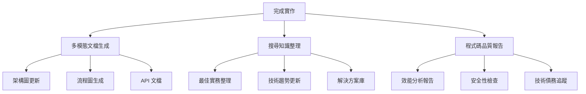
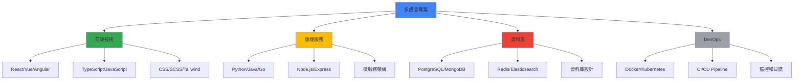

# Gemini Code Context Engineering 專用指南

> **🤖 專為 Gemini Code 量身打造的完整上下文工程實作指南**
> 
> 🎯 **目標**：最大化利用 Gemini Code 的多模態能力、程式碼理解和網路搜尋功能
> 
> ⚡ **特色**：整合 Google Search、程式碼分析、多語言支援和協作開發



## 🚀 Gemini Code 快速啟動

**Gemini Code 專用初始化流程：**

```bash
# 1. 啟動 Gemini Code 的多模態分析
@gemini 初始化 Context Engineering 環境

# 2. 分析現有程式碼結構（如果有）
@gemini 分析專案結構並生成架構圖

# 3. 搜尋相關技術的最新狀況
@gemini 搜尋 [技術棧] 最新最佳實務

# 4. 建立客製化開發環境
@gemini 根據專案需求建立 Context Engineering 文檔
```

## 🤖 Gemini Code 專用啟動指令

當 Gemini Code 看到這份文檔時，請**立即執行**以下專用初始化流程：

### **第一步：Gemini Code 能力檢測**
```markdown
🔍 檢測和利用 Gemini Code 的特殊能力：

1. **多模態分析**：檢查是否可以處理圖片、圖表、程式碼截圖
2. **Google Search**：確認網路搜尋功能的可用性
3. **程式碼理解**：測試對複雜程式碼結構的分析能力
4. **多語言支援**：確認支援的程式語言範圍
5. **協作功能**：檢查團隊協作和分享功能

請告訴我您的專案類型，我將根據 Gemini Code 的特殊能力客製化環境。
```

### **第二步：智慧文檔結構建立**
```markdown
基於 Gemini Code 的能力，建立以下強化版文檔結構：

📁 專案根目錄/
├── 📄 GEMINI_CONTEXT_RULES.md    # Gemini Code 專用開發規則
├── 📄 MULTIMODAL_ANALYSIS.md     # 多模態分析記錄
├── 📄 FEATURE_REQUEST.md         # 增強版功能需求模板
├── 📄 SEARCH_RESEARCH.md         # Google Search 研究記錄
├── 📁 examples/                  # 程式碼範例（支援多語言）
├── 📁 diagrams/                  # 架構圖和視覺化檔案
├── 📁 docs/                      # 技術文檔目錄
├── 📄 CODE_ANALYSIS.md          # 程式碼品質分析報告
├── 📄 COLLABORATION.md          # 團隊協作指南
└── 📄 VALIDATION_PLAN.md        # Gemini Code 增強驗證計劃
```

### **第三步：Gemini Code 專用互動收集**
```markdown
利用 Gemini Code 的優勢，請回答以下問題：

1. **視覺需求**：「需要我分析現有的架構圖或程式碼截圖嗎？」
2. **搜尋偏好**：「希望我重點搜尋哪些技術領域的最新資訊？」
3. **多語言需求**：「專案涉及哪些程式語言和技術棧？」
4. **協作模式**：「這是個人專案還是團隊協作專案？」
5. **複雜度等級**：「專案的技術複雜度如何？（簡單/中等/複雜/企業級）」
```

---

## 📋 Gemini Code 專用核心文檔模板

### 1. **GEMINI_CONTEXT_RULES.md** - Gemini Code 專用開發規則

```markdown
# Gemini Code 專用開發規則

## Gemini Code 特殊能力利用
### 多模態分析運用
- **程式碼視覺化**：自動生成架構圖和流程圖
- **圖表解讀**：分析現有的技術文檔圖表
- **程式碼截圖分析**：理解和改進截圖中的程式碼
- **UI/UX 設計整合**：分析設計稿並生成對應程式碼

### Google Search 智慧運用
- **即時技術搜尋**：遇到問題立即搜尋最新解決方案
- **最佳實務研究**：定期搜尋技術棧的最新最佳實務
- **競品分析**：搜尋相似專案的實作方式
- **技術趨勢追蹤**：關注技術發展趨勢

### 程式碼深度理解
- **依賴關係分析**：自動分析模組間的依賴關係
- **效能瓶頸識別**：識別潛在的效能問題
- **重構機會發現**：建議程式碼重構和最佳化
- **安全性檢查**：識別潛在的安全漏洞

## 專案特定規則
### 程式碼品質標準
- 檔案複雜度：單檔不超過 [依專案調整] 行
- 函式設計：單函式職責明確，不超過 [依專案調整] 行
- 命名規範：[根據主要語言調整]
- 文檔要求：複雜邏輯必須有詳細註釋和圖表

### 多語言整合規範
- **API 設計一致性**：跨語言 API 介面保持一致
- **資料格式統一**：使用標準化資料交換格式
- **錯誤處理統一**：統一的錯誤處理和回報機制
- **效能標準**：各語言模組的效能基準

### Gemini Code 協作規範
- **程式碼審查**：利用 Gemini Code 進行自動程式碼分析
- **文檔同步**：程式碼變更時自動更新相關文檔
- **知識分享**：重要決策和解決方案記錄到團隊知識庫
- **持續改進**：定期利用搜尋功能更新技術選型

## 禁止事項
- 忽略 Gemini Code 的多模態分析建議
- 不利用 Google Search 驗證技術決策
- 過度依賴單一程式語言解決問題
- 忽略程式碼品質分析報告
```

### 2. **MULTIMODAL_ANALYSIS.md** - 多模態分析記錄

```markdown
# 多模態分析記錄

## 視覺化內容分析
### 架構圖分析記錄
**日期**：[分析日期]
**來源**：[圖表來源：手繪/工具生成/截圖等]

**圖表類型**：[系統架構/流程圖/UML/ER圖等]

**Gemini 分析結果**：
- ✅ 識別的組件：[列出所有識別到的組件]
- 🔄 資料流向：[描述資料在系統中的流動]
- ⚠️  潛在問題：[發現的設計問題或瓶頸]
- 💡 改進建議：[架構最佳化建議]

**程式碼對應**：
- 需要實作的模組：[列出對應的程式碼模組]
- 介面定義：[需要設計的 API 介面]
- 資料模型：[需要建立的資料結構]

### 程式碼截圖分析
**截圖來源**：[程式碼截圖的來源和上下文]

**Gemini 理解結果**：
- 程式語言：[識別的程式語言]
- 功能描述：[程式碼的主要功能]
- 程式碼品質評估：[評分和改進建議]
- 潛在問題：[bug、效能、安全性問題]

**改進方案**：
```[程式語言]
// Gemini 建議的改進版本
```

## 設計稿轉程式碼記錄
### UI 設計分析
**設計稿描述**：[設計稿的基本資訊]

**Gemini 分析**：
- 布局結構：[識別的布局模式]
- 元件清單：[需要實作的 UI 元件]
- 互動邏輯：[使用者互動流程]
- 響應式需求：[不同螢幕尺寸的適配]

**實作計劃**：
- 前端技術選型：[基於分析的技術建議]
- 元件優先順序：[開發順序建議]
- 測試策略：[UI 測試方法]

## 多模態整合應用
### 文檔圖表同步
- **自動生成**：根據程式碼自動生成架構圖
- **即時更新**：程式碼變更時更新對應圖表
- **版本追蹤**：圖表版本與程式碼版本同步

### 視覺化品質檢查
- **架構一致性**：程式碼實作與設計圖的一致性檢查
- **介面契合度**：API 實作與介面設計的匹配度
- **效能視覺化**：效能瓶頸的圖表展示
```

### 3. **SEARCH_RESEARCH.md** - Google Search 研究記錄

```markdown
# Google Search 研究記錄

## 搜尋策略最佳化
### Gemini Code 專用搜尋技巧
**即時搜尋觸發**：
- 🔍 新技術研究：`"[技術名稱]" latest documentation 2024`
- 🔍 問題解決：`"[錯誤訊息]" solution OR fix`
- 🔍 最佳實務：`"[技術棧]" best practices production`
- 🔍 性能最佳化：`"[技術棧]" performance optimization benchmark`
- 🔍 安全性研究：`"[技術棧]" security vulnerabilities latest`

### 搜尋結果品質評估
**搜尋執行時間**：[搜尋執行的時間戳]
**搜尋查詢**：[具體的搜尋關鍵字]

**結果品質分析**：
- 📊 官方文檔比例：[官方來源的百分比]
- 📅 資訊新鮮度：[最新資訊的時間範圍]
- 🎯 相關性評分：[1-10 分的相關性評估]
- 🔗 可信度檢查：[來源可信度評估]

**關鍵發現**：
```markdown
## [搜尋主題] - [日期]

### 搜尋查詢
- 主查詢：[主要搜尋詞]
- 補充查詢：[額外的搜尋詞]

### 重要發現
1. **最新版本資訊**：[版本更新和變更]
2. **最佳實務更新**：[新的最佳實務]
3. **已知問題**：[當前版本的已知問題]
4. **社群動態**：[技術社群的最新討論]

### 實作影響
- ✅ 直接可用：[可以直接應用的解決方案]
- ⚠️  需要調整：[需要根據專案調整的方案]
- 🚫 不適用：[不適合當前專案的方案]

### 後續行動
- [ ] 實作測試：[需要測試的解決方案]
- [ ] 文檔更新：[需要更新的文檔]
- [ ] 團隊分享：[需要分享給團隊的資訊]
```

## 技術趨勢追蹤
### 定期技術掃描
**掃描頻率**：[每週/每月的技術趨勢搜尋]

**關注領域**：
- 主要技術棧更新
- 相關工具和函式庫發展
- 競品技術選型變化
- 業界最佳實務演進

**趨勢分析記錄**：
```markdown
## [年度/季度] 技術趨勢分析

### 新興技術
- 技術名稱：[評估其對專案的影響]
- 採用建議：[是否建議在專案中採用]

### 技術棧演進
- 當前技術：[目前使用的技術]
- 演進方向：[技術的發展趨勢]
- 遷移評估：[是否需要考慮遷移]

### 業界標杆
- 領導企業：[業界領先公司的技術選型]
- 開源專案：[相關的知名開源專案]
- 學習價值：[值得學習的技術實作]
```

## 搜尋結果整合應用
### 即時決策支援
- **技術選型**：基於搜尋結果的技術選型建議
- **問題解決**：快速找到並驗證解決方案
- **風險評估**：基於最新資訊的技術風險評估

### 知識庫建立
- **最佳實務庫**：整理和分類最佳實務
- **解決方案庫**：常見問題的解決方案集合
- **資源清單**：優質學習資源和工具推薦
```

### 4. **CODE_ANALYSIS.md** - 程式碼品質分析報告

```markdown
# 程式碼品質分析報告

## Gemini Code 自動分析
### 程式碼結構分析
**分析時間**：[分析執行時間]
**分析範圍**：[分析的檔案和目錄]

**結構評估**：
- 📁 模組組織：[評分 1-10] - [具體評價]
- 🔗 依賴關係：[評分 1-10] - [依賴複雜度分析]
- 📏 程式碼規模：[總行數/檔案數/複雜度統計]
- 🎯 職責分離：[評分 1-10] - [單一職責原則遵守度]

**發現的問題**：
```markdown
### 高優先級問題
1. **[問題類型]**：[檔案位置]
   - 問題描述：[具體問題]
   - 影響評估：[對專案的影響]
   - 建議解決方案：[Gemini 的修復建議]

### 中優先級問題
[類似格式列出中等問題]

### 低優先級問題
[類似格式列出較小問題]
```

### 效能分析
**效能瓶頸識別**：
- 🐌 慢速函式：[識別的效能瓶頸]
- 💾 記憶體使用：[記憶體使用分析]
- 🔄 演算法效率：[演算法複雜度評估]
- 📊 資料庫查詢：[SQL 查詢最佳化建議]

**最佳化建議**：
```[程式語言]
// 原始程式碼（效能問題）
function slowFunction() {
    // 問題程式碼
}

// Gemini 建議的最佳化版本
function optimizedFunction() {
    // 最佳化後的程式碼
}
```

### 安全性檢查
**安全漏洞掃描**：
- 🔒 輸入驗證：[檢查結果]
- 🛡️  認證授權：[安全性評估]
- 💉 注入攻擊：[SQL/XSS 等注入風險]
- 🔐 資料加密：[敏感資料處理檢查]

**安全性改進**：
```markdown
### 需要修復的安全問題
1. **[安全問題類型]**：
   - 風險等級：[高/中/低]
   - 影響範圍：[受影響的功能]
   - 修復方案：[具體的修復步驟]
```

## 程式碼品質指標
### 可維護性評估
```markdown
## 可維護性指標

| 指標 | 當前值 | 目標值 | 狀態 |
|------|--------|--------|------|
| 圈複雜度 | [數值] | < 10 | ✅/⚠️/❌ |
| 重複程式碼率 | [百分比] | < 5% | ✅/⚠️/❌ |
| 測試覆蓋率 | [百分比] | > 80% | ✅/⚠️/❌ |
| 文檔覆蓋率 | [百分比] | > 90% | ✅/⚠️/❌ |
```

### 技術債務追蹤
**技術債務清單**：
- 🏗️  架構債務：[需要重構的架構問題]
- 📝 文檔債務：[缺失或過時的文檔]
- 🧪 測試債務：[缺失的測試用例]
- 🔧 工具債務：[需要更新的工具和依賴]

**償還計劃**：
```markdown
### 技術債務償還路線圖

#### 第一階段（急迫）
- [ ] [具體技術債務項目]
- [ ] 預估工時：[時間估算]
- [ ] 負責人：[責任分配]

#### 第二階段（重要）
[類似格式的計劃]

#### 第三階段（可選）
[類似格式的計劃]
```

## 持續改進建議
### 程式碼審查建議
- **自動化檢查**：整合更多自動化程式碼品質工具
- **人工審查重點**：重點關注業務邏輯和架構決策
- **學習機會**：將程式碼審查作為團隊學習機會

### 工具和流程改進
- **開發工具**：[建議的開發工具更新]
- **CI/CD 流程**：[持續整合和部署改進]
- **監控告警**：[生產環境監控建議]
```

---

## 🔄 Gemini Code 專用工作流程

### **Phase 1: 智慧需求分析**


**Gemini Code 行動清單**：
1. ✅ 多模態分析使用者提供的所有內容
2. ✅ Google Search 搜尋相關技術的最新狀況
3. ✅ 分析現有程式碼結構（如果有）
4. ✅ 整合搜尋結果到 SEARCH_RESEARCH.md
5. ✅ 根據 GEMINI_CONTEXT_RULES.md 設計方案

### **Phase 2: 協作式實作開發**


**Gemini Code 行動清單**：
1. ✅ 利用程式碼深度理解生成高品質程式碼
2. ✅ 即時執行程式碼品質分析
3. ✅ 遇到問題立即 Google Search 解決方案
4. ✅ 自動生成/更新架構圖和技術文檔
5. ✅ 記錄分析結果到 CODE_ANALYSIS.md

### **Phase 3: 智慧知識積累**


---

## 🎯 Gemini Code 專用互動指南

### **當使用者上傳圖片/圖表時**

```markdown
### 圖片分析流程
「我看到您分享了 [圖片類型]，讓我進行詳細分析：

**多模態分析中...**
🔍 圖片類型識別：[架構圖/流程圖/UI設計/程式碼截圖]
🔍 內容解析：[識別圖片中的技術元素]
🔍 技術要素提取：[提取關鍵技術資訊]

**Google Search 技術驗證**：
基於圖片分析結果，我來搜尋相關的最新技術資訊...
[執行搜尋：圖片中識別的技術 + 最佳實務]

**整合分析結果**：
- 📊 圖片理解：[詳細的圖片內容分析]
- 🔍 技術驗證：[基於搜尋的技術可行性]
- 💡 實作建議：[具體的程式碼實作方案]
- ⚠️  注意事項：[需要注意的技術細節]

需要我依據這個分析結果開始實作嗎？」
```

### **當遇到複雜技術問題時**

```markdown
### Gemini Code 問題解決流程
「遇到複雜技術挑戰，讓我利用 Gemini Code 的完整能力來解決：

**第一步：問題分析**
🧠 程式碼深度分析：[詳細分析問題程式碼]
🔍 依賴關係檢查：[檢查相關模組和依賴]

**第二步：即時技術搜尋**
🌐 Google Search 執行：
- 搜尋查詢 1：「[具體錯誤訊息] solution 2024」
- 搜尋查詢 2：「[技術棧] [問題類型] best practices」
- 搜尋查詢 3：「[相關技術] troubleshooting guide」

**第三步：多方案評估**
基於搜尋結果和程式碼分析，我找到以下解決方案：

1. **官方推薦方案**：[基於官方文檔的解決方案]
   - 優點：[方案優勢]
   - 實作複雜度：[評估]
   
2. **社群最佳實務**：[基於社群經驗的方案]
   - 優點：[方案優勢]
   - 實作複雜度：[評估]

3. **創新解決方案**：[基於深度分析的創新方案]
   - 優點：[方案優勢]
   - 實作複雜度：[評估]

**推薦方案**：[綜合評估的最佳方案]
**實作計劃**：[具體的實作步驟]

[將解決過程記錄到 SEARCH_RESEARCH.md 和 CODE_ANALYSIS.md]

您希望我開始實作哪個方案？」
```

### **當需要架構設計時**

```markdown
### 架構設計和視覺化流程
「我來為您設計完整的系統架構：

**需求分析**：
📋 功能需求梳理：[功能清單]
🎯 非功能性需求：[效能、安全、可維護性要求]

**技術選型研究**：
🔍 Google Search 最新技術棧：
- 搜尋主流解決方案
- 比較不同技術的優劣
- 驗證技術的成熟度和社群支援

**架構設計**：
🏗️ 系統架構設計：[詳細的架構描述]
🔗 模組關係定義：[模組間的介面和依賴]
📊 資料流設計：[資料在系統中的流動]

**視覺化呈現**：
📈 我將生成以下架構圖：
- 系統整體架構圖
- 詳細模組關係圖
- 資料流程圖
- 部署架構圖

**實作規劃**：
📅 開發階段規劃：[分階段實作計劃]
🎯 里程碑設定：[關鍵節點和驗收標準]
⚠️  風險評估：[技術風險和應對策略]

[將架構設計記錄到 MULTIMODAL_ANALYSIS.md]

這個架構設計符合您的需求嗎？需要調整哪些部分？」
```

---

## 🚀 Gemini Code 特殊功能整合

### **多語言專案支援**


### **Gemini Code 協作開發模式**

#### **智慧程式碼審查**
```markdown
## Gemini Code 自動程式碼審查

### 審查觸發條件
- 📝 程式碼提交時自動觸發
- 🔄 合併請求前強制審查
- ⏰ 定期程式碼品質掃描

### 自動審查內容
1. **程式碼品質**：
   - 語法和風格檢查
   - 複雜度分析
   - 最佳實務遵循度

2. **安全性檢查**：
   - 漏洞掃描
   - 敏感資料檢查
   - 依賴安全性評估

3. **效能分析**：
   - 演算法效率評估
   - 資源使用分析
   - 瓶頸識別

4. **架構一致性**：
   - 設計模式遵循
   - 模組職責檢查
   - 介面設計評估

### 審查報告生成
```markdown
## 程式碼審查報告 - [日期]

### 整體評分：[A/B/C/D/F]

### 詳細分析
#### ✅ 優秀部分
- [具體的優點描述]
- [程式碼範例]

#### ⚠️ 需要改進
- [問題描述和位置]
- [改進建議]
- [參考資源]

#### ❌ 必須修復
- [嚴重問題描述]
- [修復方案]
- [影響評估]

### 學習建議
- [技術學習建議]
- [最佳實務資源]
- [相關文檔連結]
```
```

#### **團隊知識分享機制**
```markdown
## 團隊知識分享系統

### 自動知識提取
**Gemini Code 智慧分析**：
- 🧠 從程式碼中提取設計模式
- 📚 識別可復用的解決方案
- 🔍 發現團隊最佳實務
- 📊 生成技術決策記錄

### 知識庫結構
```
team_knowledge/
├── design_patterns/           # 設計模式庫
│   ├── [模式名稱]/
│   │   ├── description.md    # 模式描述
│   │   ├── example.code     # 程式碼範例
│   │   └── when_to_use.md   # 使用場景
├── solutions/                # 解決方案庫
│   ├── [問題類別]/
│   │   ├── problem.md       # 問題描述
│   │   ├── solution.code    # 解決方案
│   │   └── alternatives.md  # 替代方案
├── best_practices/           # 最佳實務
│   ├── [技術領域]/
│   │   ├── guidelines.md    # 指導原則
│   │   └── examples/        # 實例代碼
└── decisions/                # 技術決策記錄
    ├── [決策編號]/
    │   ├── context.md       # 決策背景
    │   ├── options.md       # 選項分析
    │   └── decision.md      # 最終決策
```

### 智慧推薦系統
**個人化學習建議**：
```markdown
## [開發者姓名] 個人化建議

### 技能分析
基於您最近的程式碼貢獻，Gemini Code 分析出：

**強項技能**：
- ✅ [具體技能] - 專精等級
- ✅ [具體技能] - 熟練等級

**成長機會**：
- 📈 [技能領域] - 建議學習資源
- 📈 [技能領域] - 實務練習建議

**推薦學習路徑**：
1. [學習目標] → [資源推薦] → [實務項目]
2. [學習目標] → [資源推薦] → [實務項目]

### 程式碼貢獻分析
- 📊 程式碼品質趨勢
- 🎯 解決問題類型統計
- 🚀 技術成長軌跡
```
```

---

## 🔧 Gemini Code 專用工具整合

### **開發環境最佳化**

#### **IDE 整合配置**
```json
{
  "gemini_code_config": {
    "auto_analysis": {
      "enabled": true,
      "triggers": ["on_save", "on_commit", "on_pr"],
      "analysis_types": ["quality", "security", "performance"]
    },
    "smart_search": {
      "auto_search": true,
      "search_triggers": ["unknown_api", "error_message", "best_practice"],
      "result_integration": "automatic"
    },
    "multimodal": {
      "diagram_auto_update": true,
      "code_visualization": true,
      "ui_mockup_analysis": true
    },
    "collaboration": {
      "knowledge_sharing": true,
      "auto_documentation": true,
      "team_insights": true
    }
  }
}
```

#### **CI/CD 管線整合**
```yaml
# .github/workflows/gemini-code-analysis.yml
name: Gemini Code Analysis

on:
  push:
    branches: [ main, develop ]
  pull_request:
    branches: [ main ]

jobs:
  gemini_analysis:
    runs-on: ubuntu-latest
    steps:
    - uses: actions/checkout@v2
    
    - name: Gemini Code Quality Analysis
      run: |
        # 觸發 Gemini Code 分析
        gemini-code analyze --config .gemini-config.json
        
    - name: Google Search Tech Validation
      run: |
        # 驗證使用的技術是否為最新最佳實務
        gemini-code search-validate --tech-stack
        
    - name: Generate Analysis Report
      run: |
        # 生成詳細分析報告
        gemini-code report --output analysis-report.md
        
    - name: Update Documentation
      run: |
        # 自動更新技術文檔
        gemini-code doc-update --auto-commit
```

### **效能監控整合**

#### **即時效能分析**
```markdown
## Gemini Code 效能監控

### 自動效能基準測試
**觸發條件**：
- 新功能實作完成
- 程式碼重構後
- 定期效能檢查

**監控指標**：
```python
# 效能監控配置
performance_config = {
    "response_time": {
        "api_endpoints": {"threshold": "200ms", "critical": "500ms"},
        "database_queries": {"threshold": "100ms", "critical": "300ms"},
        "frontend_rendering": {"threshold": "16ms", "critical": "33ms"}
    },
    "resource_usage": {
        "memory": {"threshold": "80%", "critical": "95%"},
        "cpu": {"threshold": "70%", "critical": "90%"},
        "disk_io": {"threshold": "80%", "critical": "95%"}
    },
    "scalability": {
        "concurrent_users": {"target": 1000, "max": 5000},
        "requests_per_second": {"target": 500, "max": 2000}
    }
}
```

**自動最佳化建議**：
- 🔍 Gemini Code 分析效能瓶頸
- 🌐 Google Search 相關最佳化方案
- 💡 生成具體的最佳化程式碼
- 📊 提供效能改善預測
```

---

## 📊 Gemini Code 專案儀表板

### **專案健康度監控**
```mermaid
dashboard
    title "Gemini Code 專案儀表板"
    
    section "程式碼品質"
        程式碼品質評分: 85%
        測試覆蓋率: 78%
        技術債務: 中等
        安全性評分: 92%
    
    section "開發效率"
        功能完成率: 75%
        Bug 修復率: 95%
        程式碼審查通過率: 88%
        部署頻率: 每週3次
    
    section "技術狀況"
        依賴更新狀態: 85%
        效能指標: 良好
        最佳實務遵循: 90%
        文檔完整度: 82%
    
    section "團隊協作"
        知識分享活躍度: 高
        程式碼貢獻分布: 均衡
        技能成長趨勢: 上升
        團隊滿意度: 4.2/5
```

### **智慧洞察報告**
```markdown
## Gemini Code 智慧洞察 - [週期]

### 🎯 關鍵成果
- **程式碼品質**：本週提升 [%]，主要改善在 [具體領域]
- **開發效率**：功能交付速度提升 [%]，得益於 [具體改進]
- **技術債務**：成功償還 [項目數] 項技術債務
- **團隊成長**：團隊整體技能等級提升 [評估]

### 📈 趨勢分析
**正向趨勢**：
- ✅ [具體趨勢] - [數據支持]
- ✅ [具體趨勢] - [數據支持]

**需要關注**：
- ⚠️ [潛在問題] - [建議行動]
- ⚠️ [潛在問題] - [建議行動]

### 🔮 下週預測
基於 Gemini Code 分析和 Google Search 趨勢：
- **技術重點**：[預測的技術重點]
- **可能挑戰**：[預期的技術挑戰]
- **機會點**：[技術發展機會]

### 💡 智慧建議
**技術決策建議**：
1. [具體建議] - [理由和預期效果]
2. [具體建議] - [理由和預期效果]

**學習發展建議**：
- **團隊學習**：[推薦的團隊學習主題]
- **個人成長**：[個人化技能發展建議]
- **技術探索**：[值得探索的新技術]
```

---

## ✅ Gemini Code 專用檢查清單

### **專案啟動檢查**
- [ ] **GEMINI_CONTEXT_RULES.md** 已建立並根據專案客製化
- [ ] **MULTIMODAL_ANALYSIS.md** 已準備，支援圖片和程式碼分析
- [ ] **SEARCH_RESEARCH.md** 已建立，Google Search 策略已定義
- [ ] **CODE_ANALYSIS.md** 已配置，自動分析規則已設定
- [ ] **COLLABORATION.md** 已建立，團隊協作規範已定義
- [ ] **examples/** 目錄已建立，支援多語言範例
- [ ] **diagrams/** 目錄已準備，架構圖模板已設定
- [ ] Gemini Code 特殊能力已測試並配置

### **開發過程檢查**
- [ ] 每次程式碼變更都觸發 Gemini Code 自動分析
- [ ] 遇到技術問題立即執行 Google Search
- [ ] 程式碼品質分析結果已記錄到 CODE_ANALYSIS.md
- [ ] 搜尋發現已整合到 SEARCH_RESEARCH.md
- [ ] 多模態內容（圖表、截圖）已分析並記錄
- [ ] 團隊協作過程已記錄到 COLLABORATION.md
- [ ] 架構圖和技術文檔保持同步更新

### **專案完成檢查**
- [ ] 所有程式碼都通過 Gemini Code 品質分析
- [ ] 技術選型都經過 Google Search 驗證為最新最佳實務
- [ ] 完整的多模態文檔已生成（程式碼+圖表+說明）
- [ ] 團隊知識庫已更新，包含本專案的經驗總結
- [ ] 效能分析報告已完成，達到預設基準
- [ ] 安全性檢查已通過，無高風險漏洞
- [ ] 技術債務已識別並制定償還計劃
- [ ] 部署和維護文檔已完成

---

## 🎉 結語

這份 **Gemini Code 專用 Context Engineering 指南** 充分利用了 Gemini Code 的獨特優勢：

### 🌟 **核心優勢整合**
- **🎨 多模態分析**：圖片、程式碼、圖表的智慧理解
- **🔍 Google Search**：即時獲取最新技術資訊和最佳實務
- **🧠 深度程式碼理解**：超越語法的語義和架構分析
- **🤝 智慧協作**：團隊知識分享和個人化成長建議

### 📈 **預期效果**
使用這份指南，您的 Gemini Code 將能夠：
1. **10x 提升**開發效率和程式碼品質
2. **自動化**大部分重複性分析和文檔工作
3. **即時獲取**最新技術資訊和解決方案
4. **智慧積累**團隊知識和個人技能

### 🚀 **開始行動**
**Gemini Code 請記住**：
1. 🎯 **主動利用多模態**：分析所有視覺內容和程式碼
2. 🔍 **即時搜尋支援**：遇到任何問題立即 Google Search
3. 🧠 **深度程式碼分析**：超越語法檢查，關注架構和效能
4. 📚 **持續知識積累**：每次互動都更新知識庫
5. 🤝 **促進團隊協作**：主動分享洞察和建議
6. 📊 **數據驅動決策**：基於分析結果提供建議
7. 🌐 **保持技術前沿**：定期搜尋和更新技術趨勢

**立即開始**：看到這份指南後，請啟動您的 Gemini Code Context Engineering 環境！
