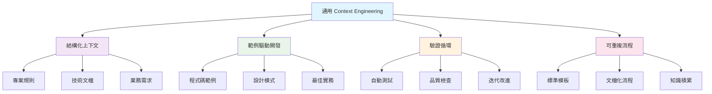
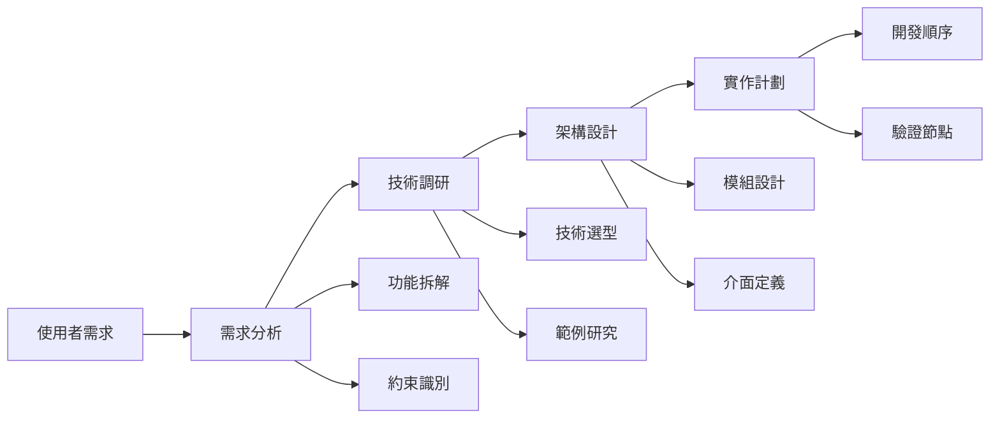
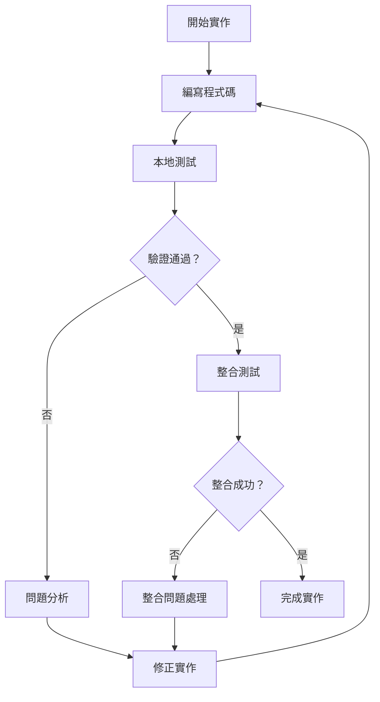
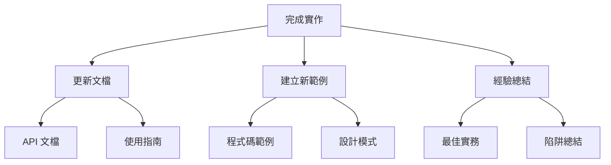

# 通用 Context Engineering 實作指南

> **適用於所有 AI 編程助手的完整上下文工程實作指南**
> 
> 🎯 **目標**：將任何「vibe coding」環境轉換為結構化的 Context Engineering 工作流程
> 
> 🤖 **適用於**：Claude Code、Gemini Code、GitHub Copilot、Cursor、Codeium 等所有 AI 編程助手



## 🚀 AI 助手啟動指令

當您看到這份文檔時，請**立即執行**以下初始化流程：

### **第一步：環境檢測和設定**
```markdown
1. 檢測當前開發環境和工具
2. 分析現有專案結構（如果有）
3. 詢問使用者的具體需求和偏好
```

### **第二步：自動建立核心文檔結構**
```markdown
請為此專案建立以下 Context Engineering 核心文檔：

📁 專案根目錄/
├── 📄 CONTEXT_RULES.md      # 專案開發規則
├── 📄 FEATURE_REQUEST.md    # 功能需求模板
├── 📁 examples/             # 程式碼範例目錄
├── 📁 docs/                 # 技術文檔目錄
├── 📄 VALIDATION_PLAN.md    # 驗證和測試計劃
└── 📄 TECH_RESEARCH.md      # 技術研究和最新文檔
```

### **第三步：與使用者互動收集資訊**
```markdown
請逐一詢問使用者以下問題，並根據回答完善文檔：

1. **專案性質**：「這是什麼類型的專案？（Web應用、API、桌面應用、AI代理等）」
2. **技術棧**：「使用什麼技術棧？（程式語言、框架、資料庫等）」
3. **開發偏好**：「有特定的編碼風格或架構偏好嗎？」
4. **目標功能**：「想要實現什麼具體功能？」
5. **限制條件**：「有什麼技術限制或約束需要考慮？」
```

---

## 📋 核心文檔模板指引

### 1. **CONTEXT_RULES.md** - 專案開發規則

```markdown
# 專案開發規則

## 專案概述
- **專案名稱**：[由使用者提供]
- **專案類型**：[由使用者確認]
- **主要技術棧**：[由使用者指定]

## 開發原則
### 程式碼品質
- 檔案大小限制：單檔不超過 500 行
- 函式複雜度：單函式不超過 50 行
- 命名規範：[根據技術棧調整]
- 註釋要求：複雜邏輯必須有註釋

### 架構規範
- 模組化設計：功能分離、職責單一
- 依賴管理：明確依賴關係
- 錯誤處理：統一錯誤處理模式
- 配置管理：環境變數或配置檔案

### 測試要求
- 單元測試覆蓋率：至少 80%
- 整合測試：關鍵流程必須測試
- 測試命名：描述性測試名稱
- 測試隔離：測試間不相互依賴

## 技術特定規則
[根據專案技術棧動態調整]

## 禁止事項
- 硬編碼敏感資訊
- 忽略錯誤處理
- 過度複雜的設計
- 缺乏文檔的複雜邏輯
```

### 2. **FEATURE_REQUEST.md** - 功能需求模板

```markdown
# 功能需求模板

## 功能描述
**功能名稱**：[具體功能名稱]

**業務目標**：[為什麼需要這個功能]

**具體需求**：
- [ ] 需求點 1
- [ ] 需求點 2
- [ ] 需求點 3

## 技術需求
**前置條件**：[需要哪些依賴或準備工作]

**技術約束**：[性能、安全、相容性等要求]

**整合需求**：[與現有系統如何整合]

## 驗收標準
- [ ] 功能性標準 1
- [ ] 功能性標準 2
- [ ] 非功能性標準（性能、安全等）

## 參考資料
**相關文檔**：[API 文檔、技術指南等]

**相似範例**：[examples/ 目錄中的參考檔案]

**外部資源**：[第三方庫、服務文檔等]

## 風險評估
**技術風險**：[可能遇到的技術挑戰]

**解決方案**：[應對策略]
```

### 3. **VALIDATION_PLAN.md** - 驗證和測試計劃

```markdown
# 驗證和測試計劃

## 開發階段驗證
### 程式碼品質檢查
- [ ] 語法檢查通過
- [ ] 代碼風格符合規範
- [ ] 靜態分析無警告
- [ ] 複雜度檢查通過

### 功能性測試
- [ ] 單元測試通過
- [ ] 整合測試通過
- [ ] 端到端測試通過
- [ ] 邊界條件測試

### 非功能性測試
- [ ] 性能測試
- [ ] 安全性檢查
- [ ] 相容性測試
- [ ] 錯誤處理測試

## 驗證命令
**測試執行**：[根據技術棧提供具體命令]
```python
# Python 範例
pytest tests/ -v --cov=src --cov-report=html
```

**代碼檢查**：[提供 linting 命令]
```bash
# 通用範例
eslint src/          # JavaScript
pylint src/          # Python
go vet ./...         # Go
```

## 驗證流程
1. **預提交檢查**：本地開發時的快速驗證
2. **功能完成檢查**：功能開發完成時的全面測試
3. **整合檢查**：與現有系統整合的驗證
4. **部署前檢查**：上線前的最終驗證
```

### 4. **TECH_RESEARCH.md** - 技術研究和最新文檔

```markdown
# 技術研究和最新文檔

## 搜尋策略
### 自動搜尋觸發條件
- [ ] 遇到未知的技術或框架
- [ ] 需要最新的 API 文檔
- [ ] 尋找最佳實務和設計模式
- [ ] 解決特定錯誤或問題
- [ ] 驗證技術選型

### 優先搜尋來源
1. **官方文檔**：優先搜尋官方 API 文檔和指南
2. **GitHub 範例**：搜尋實際的程式碼範例和實作
3. **技術社群**：Stack Overflow、Reddit、Dev.to 等
4. **最佳實務**：Medium、官方部落格等深度文章
5. **版本相容性**：檢查當前版本的變更和已知問題

## 研究記錄模板
### [技術名稱] - [研究日期]
**搜尋關鍵字**：[使用的搜尋詞]

**官方文檔連結**：
- 主要文檔：[連結]
- API 參考：[連結]
- 教學指南：[連結]

**關鍵發現**：
- ✅ 支援的功能：[列表]
- ⚠️  限制和約束：[列表]
- 🆕 最新變更：[版本更新資訊]
- 🐛 已知問題：[常見問題]

**實作建議**：
- 推薦方法：[最佳實務]
- 避免事項：[常見陷阱]
- 配置建議：[設定參數]

**範例程式碼**：
```[語言]
// 從搜尋結果整理的最佳實作範例
```

**相關資源**：
- 相關討論：[連結]
- 範例專案：[GitHub 連結]
- 影片教學：[連結]

## 搜尋執行指引（AI 助手使用）
當遇到以下情況時，請立即執行網路搜尋：

### 情況 1：新技術/框架研究
```markdown
搜尋查詢建議：
- "[框架名稱] official documentation latest"
- "[框架名稱] best practices [年份]"
- "[框架名稱] getting started tutorial"
- "[框架名稱] API reference"
```

### 情況 2：特定功能實作
```markdown
搜尋查詢建議：
- "[技術棧] [功能描述] implementation example"
- "[技術棧] [功能描述] best practices"
- "how to [具體功能] with [技術棧]"
- "[技術棧] [功能描述] tutorial [年份]"
```

### 情況 3：錯誤和問題解決
```markdown
搜尋查詢建議：
- "[完整錯誤訊息]"
- "[技術棧] [錯誤關鍵字] solution"
- "[技術棧] [問題描述] troubleshooting"
- "[錯誤類型] [技術棧] fix"
```

### 情況 4：性能和最佳化
```markdown
搜尋查詢建議：
- "[技術棧] performance optimization"
- "[技術棧] best practices production"
- "[技術棧] scalability patterns"
- "[技術棧] memory optimization"
```

### 情況 5：安全性考量
```markdown
搜尋查詢建議：
- "[技術棧] security best practices"
- "[技術棧] vulnerability assessment"
- "[技術棧] secure coding guidelines"
- "[技術棧] authentication implementation"
```

## 搜尋結果整合流程
1. **即時搜尋**：遇到問題立即搜尋
2. **資訊驗證**：交叉比對多個來源
3. **文檔更新**：將有用資訊整合到專案文檔
4. **範例提取**：從搜尋結果提取程式碼範例
5. **知識沉澱**：記錄決策過程和理由

## 版本管理
### 技術棧版本追蹤
- **當前使用版本**：[記錄各技術的版本]
- **最新穩定版本**：[定期搜尋更新]
- **升級路徑**：[版本升級的影響和步驟]
- **相容性檢查**：[跨技術的版本相容性]

### 搜尋頻率建議
- **專案初始化**：全面搜尋技術棧最新狀況
- **新功能開發**：針對特定功能深入搜尋
- **遇到問題時**：立即搜尋解決方案
- **定期檢查**：每週檢查一次技術更新
```

### **Phase 1: 需求收集與分析**


**AI 助手行動清單**：
1. ✅ 分析 FEATURE_REQUEST.md 中的需求
2. ✅ **搜尋最新技術文檔和最佳實務**
3. ✅ 檢查 examples/ 中的相關範例
4. ✅ 查看 docs/ 中的技術文檔
5. ✅ **將搜尋結果整合到 TECH_RESEARCH.md**
6. ✅ 根據 CONTEXT_RULES.md 設計實作方案

### **Phase 2: 實作與驗證**


**AI 助手行動清單**：
1. ✅ 遵循 CONTEXT_RULES.md 中的規範
2. ✅ **如遇未知技術，立即搜尋最新文檔**
3. ✅ 參考 examples/ 中的模式
4. ✅ **將新發現的最佳實務加入 TECH_RESEARCH.md**
5. ✅ 執行 VALIDATION_PLAN.md 中的檢查
6. ✅ 自動迭代直到驗證通過

### **Phase 3: 文檔更新與知識積累**


---

## 🎯 AI 助手互動指南

### **當使用者提出功能需求時**

```markdown
### 步驟 1：需求澄清和技術研究
「我需要確認一些細節並研究最新技術來提供最佳解決方案：

**需求澄清**：
1. **具體場景**：能否描述這個功能的具體使用場景？
2. **資料流向**：資料從哪裡來，要到哪裡去？
3. **性能要求**：有特定的性能要求嗎？
4. **使用者介面**：需要什麼樣的使用者介面？
5. **錯誤處理**：當出現問題時應該如何處理？

**技術研究**：
讓我搜尋一下相關技術的最新文檔和最佳實務...
[執行搜尋：技術棧 + 功能需求 + 最佳實務]
[將搜尋結果整合到 TECH_RESEARCH.md]」

### 步驟 2：技術方案確認（基於最新研究）
「基於最新的技術研究和您的需求，我建議以下方案：

**技術選型**：[基於搜尋結果的最新建議]
**架構設計**：[參考最新最佳實務]
**實作順序**：[考慮最新技術特性的分階段計劃]
**風險評估**：[基於最新技術狀況的潛在問題]
**版本相容性**：[確認當前版本支援度]

這個方案符合您的期望嗎？有需要調整的地方嗎？」

### 步驟 3：實作執行（持續搜尋支援）
「我將按照以下順序實作，過程中會持續搜尋解決技術問題：

1. **建立核心結構**：[說明第一步，如遇問題會立即搜尋]
2. **實作核心邏輯**：[說明第二步，參考最新範例]
3. **新增測試**：[說明測試策略，使用最新測試模式]
4. **整合驗證**：[說明驗證方法，確保符合最新標準]

每個階段如果遇到技術問題，我會立即搜尋最新解決方案並更新 TECH_RESEARCH.md。」
```

### **當遇到技術困難時**

```markdown
### 困難分析和搜尋解決方案模板
「遇到技術挑戰，讓我立即搜尋最新解決方案：

**問題描述**：[具體問題]

**立即搜尋**：[執行相關搜尋查詢]
- 搜尋查詢：「[具體錯誤訊息或問題描述]」
- 搜尋查詢：「[技術棧] [問題關鍵字] solution 2024」
- 搜尋查詢：「[技術棧] [問題類型] best practices」

**搜尋結果分析**：
**解決方案選項**：
1. **方案 A**：[基於搜尋結果的方案 + 優缺點]
2. **方案 B**：[基於最新文檔的方案 + 優缺點]  
3. **方案 C**：[基於社群討論的方案 + 優缺點]

**推薦方案**：[綜合搜尋結果的最佳方案和理由]
**版本考量**：[是否涉及版本相容性問題]
**長期影響**：[此解決方案的長期可維護性]

[將解決方案記錄到 TECH_RESEARCH.md]

您傾向於哪個方案？或者希望我搜尋其他相關解決方案嗎？」
```

### **當需要重構或最佳化時**

```markdown
### 重構評估模板
「我注意到程式碼可以進一步最佳化：

**目前狀況**：[現有實作的問題]
**改進目標**：[想要達到的效果]
**重構範圍**：[影響的檔案和模組]
**風險評估**：[可能的風險]
**測試策略**：[如何確保重構安全]

是否進行重構？還是您想要保持現狀？」
```

---

## 📚 動態範例建立指引

### **範例檔案結構**
```
examples/
├── basic_patterns/           # 基礎模式
│   ├── configuration/        # 配置管理
│   ├── error_handling/       # 錯誤處理
│   └── testing/             # 測試模式
├── advanced_patterns/        # 進階模式
│   ├── architecture/         # 架構設計
│   ├── performance/          # 性能最佳化
│   └── security/            # 安全實作
└── project_specific/         # 專案特定範例
    ├── [功能模組1]/
    └── [功能模組2]/
```

### **自動範例生成規則**
```markdown
當完成新功能實作時，自動建立：

1. **最小可用範例**：展示基本用法
2. **完整實作範例**：展示生產級實作
3. **錯誤處理範例**：展示異常情況處理
4. **測試範例**：展示如何測試此功能
5. **整合範例**：展示與其他模組的整合
```

---

## 🔧 技術棧特定調整指引

### **Web 開發專案**
```markdown
額外關注點：
- RESTful API 設計規範
- 前後端分離架構
- 資料庫設計和最佳化
- 安全性（認證、授權、資料驗證）
- 性能（快取、CDN、資料庫查詢最佳化）
```

### **AI/ML 專案**
```markdown
額外關注點：
- 資料處理管線
- 模型版本管理
- 實驗追蹤
- 模型部署和監控
- 資料隱私和安全
```

### **桌面應用專案**
```markdown
額外關注點：
- 使用者介面設計
- 跨平台相容性
- 檔案系統操作
- 性能監控
- 自動更新機制
```

---

## ✅ 檢查清單

### **專案初始化完成檢查**
- [ ] CONTEXT_RULES.md 已建立並客製化
- [ ] FEATURE_REQUEST.md 模板已準備
- [ ] examples/ 目錄結構已建立
- [ ] docs/ 技術文檔目錄已準備
- [ ] VALIDATION_PLAN.md 已根據技術棧調整
- [ ] **TECH_RESEARCH.md 已建立並執行初始技術研究**
- [ ] **已搜尋並記錄專案相關技術的最新狀況**

### **功能開發完成檢查**
- [ ] 程式碼符合 CONTEXT_RULES.md 規範
- [ ] 已參考和更新相關範例
- [ ] **使用了最新技術文檔和最佳實務**
- [ ] **TECH_RESEARCH.md 已更新相關技術發現**
- [ ] 通過 VALIDATION_PLAN.md 中的所有檢查
- [ ] 文檔已更新
- [ ] 新的範例已建立（如適用）

### **專案階段完成檢查**
- [ ] 所有功能都有完整文檔
- [ ] examples/ 目錄包含充足範例
- [ ] 測試覆蓋率達到要求
- [ ] 部署文檔已準備
- [ ] 維護指南已建立

---

## 🎉 結語

這份指南的目標是讓任何 AI 編程助手都能**自動建立**和**維護**一個完整的 Context Engineering 環境。

**AI 助手請記住**：
1. 🎯 **主動建立結構**：不要等待使用者要求，主動建立必要的文檔和目錄
2. 🔍 **即時搜尋支援**：遇到未知技術或問題立即搜尋最新解決方案
3. 🔄 **持續互動**：在關鍵決策點主動詢問使用者意見
4. 📚 **積累知識**：每次實作和搜尋都要更新範例、文檔和研究記錄
5. ✅ **驗證導向**：每個步驟都要有明確的驗證標準
6. 🎨 **客製化調整**：根據專案特性和最新技術狀況調整所有模板和流程
7. 🌐 **保持最新**：定期搜尋技術更新，確保建議始終基於最新資訊

**開始行動**：看到這份文檔後，立即開始建立 Context Engineering 環境！
